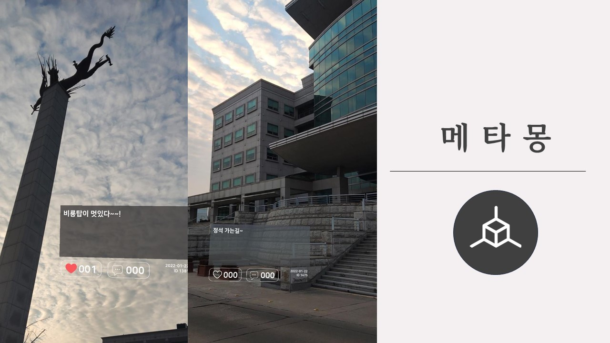
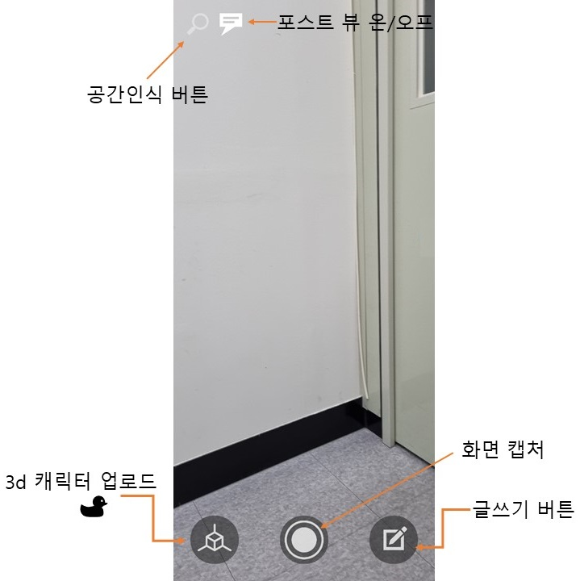
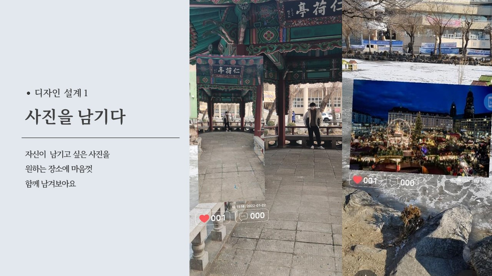
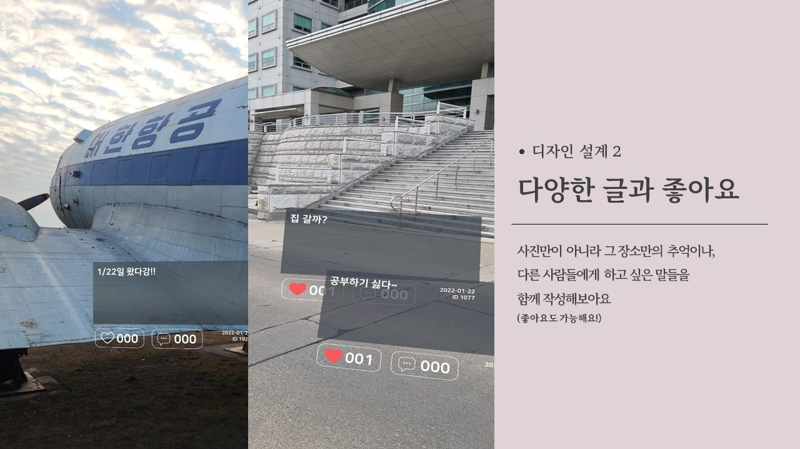
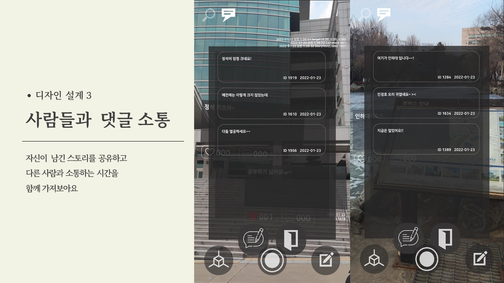
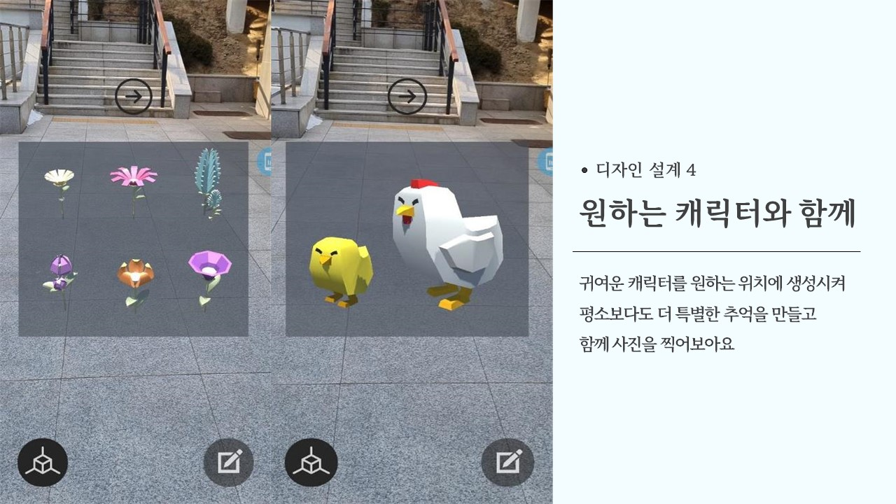

**2022슈퍼챌린지 SW해커톤**

<p align="center">
  
</p>

**추억을 더 입체감 있게 공유하는 SNS 어플리케이션 메타몽**


# 1. 프로젝트 동영상


https://drive.google.com/file/d/1HnO12c8tVPAzNL8-LVY5PvyF2ZnxiAOc/view?usp=sharing


# 2. 📖프로젝트 설명

- 참여 과제

2022 슈퍼챌린지 SW해커톤

2022-1 컴퓨터공학 종합설계

- 개발의도 및 아이디어

```
여러분들은 자신의 과거 추억을 알려주기 위해서 어떻게 하시나요?
엘범이나 일기장, sns을 통해 추억을 남기고 공유합니다. 
하지만, 실제 그 장소가 주는 생동감이 부족하고, 그 때의 감정이 잘 남지 않습니다.
좀더 생생하고 입체감있게 추억을 남기고 알려주기 위해,
AR 과 GPS를 이용한 SNS 어플리케이션을 제안합니다.
```


# 3. 프로젝트 기능

## UI

 

- 글쓰기 버튼 : 이미지, 글 포스트를 공유할 수 있는 기능.
- 공간 인식 버튼 : 3d 캐릭터를 업로드 하기위해, 공간의 평면을 인식 하는 AR 기능.
- 3D 캐릭터 업로드 버튼 :  총 14 가지의 동.식물 3D 캐릭터를 공간에 증강 시킬 수 있다.
- 포스트 뷰 온/오프 버튼 : 공간에 나타난 스토리들을 볼 수 없게 하거나 나타나게 할 수 있습니다.


## 어플리케이션 기능

|   |  |
|--|--|
|  |  |

- 1. 이미지 공유 : 자신이 남기고 싶은 사진을 원하는 장소에 남길 수 있습니다.
- 2. 글 공유 : 원하는 장소에 글을 남겨 하고싶은 말을 전해보세요.
- 3. 댓글 및 좋아요 : 자신의 스토리를 공유하고, 다른 사람과 댓글, 좋아요를 통해 소통할 수 있습니다.
- 4. 다양한 3D 캐릭터 : 총 14 가지의 동.식물 3D 캐릭터를 공간에 증강 시킬 수 있다.


## 백엔드 시스템

- Firebase / Authentication를 이용하여 유저 권환 관리
- Firebase  / Firestore를 이용하여 포스팅과 유저 프로필 관리
- Firebase / Storage를 이용하여 이미지 데이터 관리


# 4. 프로젝트 사용법

해당 프로젝트를 Clone하고 Unity로 Clone 폴더를 기존 프로젝트로 연다.
MetaMong/Assets/Scenes/Main/에 있는 LoginScene / Main / MakeSpace / MapScene 들을 Build Settins에 해당 씬들을 추가해준다.
LoginScene를 열고 시작을 해주면 테스트를 진행할 수 있다. 또한 빌드를 진행하면 APK파일로 만들 수 있다.


# 5. 프로젝트 전망

## 활용 기대

- 더 생동감 있는 추억을 제공

기존 SNS가 줄 수 없는 공간적 생동감을 제공한다.
- 뛰어난 인생샷 공유

공간을 공유하기에, 어디서 어떻게 찍어야 좋은 사진을 찍을 수 있는지 알려준다.
- 훼손 없는 추억 공유 #친환경

메타버스 안에서 이뤄지는 공간 공유

## 시장 조사

- 시장 규모

AR 환경은 아직까지 AR 장비의 한계로 VR 만큼의 플랫폼이 형성 되어있지 않다. 앞으로 기술의 발전에 따라 AR플랫폼이 확장될 것으로 기대 된다.

- 발전 가능성

구글, 애플, 삼성 등 AR 글래스의 컨셉 디자인 공개 및 출시 예정. 추후 AR 글래스의 보편화가 된다면 더 많은 사용자가 들어올 것으로 기대 된다.

## 개선 방향

- backend 시스템을 설계하여 다양한 유저의 gps 데이터와 이미지 데이터를 처리할 수 있어야한다.
- 친구 추천 기능을 도입하여, 효율적인 데이터 제공을 처리한다.
- 컨텐츠를 추가시켜, 기존 sns 이상의 편의와 재미를 제공한다.
- ar과 gps의 불안정성을 개선한다.


# 6. 프로젝트의 어려웠던 점

> 1. raycast 관련 이슈

ARraycast와 raycast를 구분하면서 개발을 하야한다.
ar관련 오브젝트를 따로 생각을 하면서 만들어야하는것이 어려웠다

> 2. Firebase 관련 이슈

firebase에서 데이터 처리시 매번 함수를 새로 만들어서 코드에 삽입하는 것이 힘들었다. 기존 rest api와 달리 event에 따라 데이터를 불러오기에, 설계에 생각이 많이 필요했다.

# 7. credit

### Unity Package
- ARLocation
- ARFoundation
- UnityNativeGallery
- LeanTouch

### Unity assets
- Lowpoly Flowers
- Meshtint Free Chicken Mega Toon Series
- Meshtint Free Chick Mega Toon Series
- Super Rubber Duck Pack

### UI
- Dark Theme UI
- UX Flat Icons [Free]


# 8. 👨‍👦‍👦팀 정보 (Team Information)

> 팀장 김대유 dea0323@gmail.com

> 팀원 이종법 bub3690@naver.com

> 팀원 박창범 eric9710@naver.com
